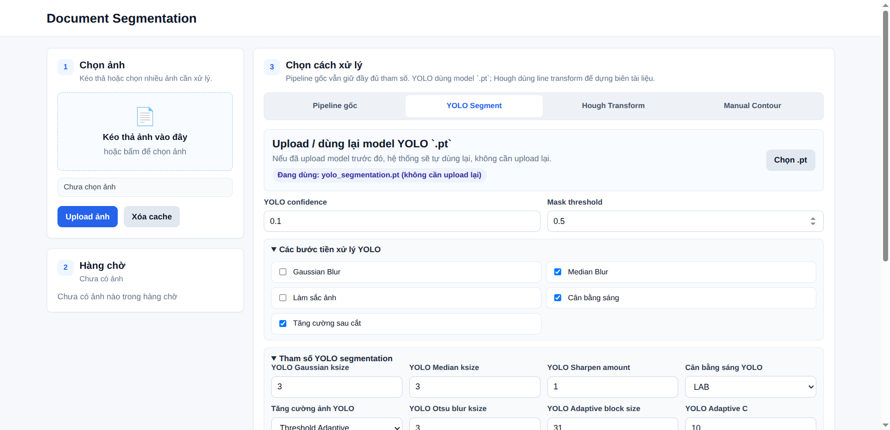

# Document Segmentation FastAPI

<p align="center">
  <a href="https://www.python.org/"></a>
  <a href="https://fastapi.tiangolo.com/"></a>
  <a href="https://opencv.org/"></a>
  <a href="https://github.com/ultralytics/ultralytics"></a>
  <a href="../../LICENSE"></a>
</p>

<p align="center">
  <b>Web application for document scanning: document region detection, perspective correction, image enhancement, and OCR.</b>
</p>

<p align="center">
  <a href="../../README.md">Vietnamese version</a>
</p>

<p align="center">
  
</p>

## Overview

This project is a FastAPI-based document scanning demo using OpenCV and YOLO Segmentation. Users can upload document images, choose a processing mode, run the scanning pipeline, preview intermediate outputs, and optionally run OCR with MinerU.

It is designed for Computer Vision coursework, document scanner prototyping, YOLO segmentation experiments, and OCR post-processing workflows.

## Features

- Upload multiple images and process them through a queue.
- Quick YOLO scan mode with a document-oriented preset.
- Custom YOLO segmentation mode with `.pt` model upload/reuse.
- Traditional OpenCV pipeline with configurable preprocessing, edge detection, morphology, contour detection, perspective transform, and enhancement.
- Hough Transform mode for line-based document boundary detection.
- Manual Contour mode for selecting four document corners manually.
- Final image enhancement with contrast adjustment, Otsu thresholding, or Adaptive Thresholding.
- Optional MinerU OCR with Markdown, JSON, PDF, and visual artifact outputs.
- Local filesystem storage for uploads, outputs, and YOLO models.

## Tech Stack

| Layer | Stack |
| --- | --- |
| Backend | FastAPI, Uvicorn, Pydantic |
| Computer Vision | OpenCV, NumPy, Pillow |
| Segmentation | Ultralytics YOLO |
| OCR | MinerU |
| Frontend | HTML, CSS, JavaScript |
| Storage | `uploads/`, `outputs/`, `models/` |

## Installation

Python 3.10 or newer is recommended.

```bash
python -m venv .venv
source .venv/bin/activate
pip install -r requirements.txt
```

Install MinerU only if OCR is needed:

```bash
uv pip install -U "mineru[all]"
```

## Run

Start the development server with Uvicorn reload:

```bash
bash script.sh dev
```

Open:

```text
http://127.0.0.1:8888
```

Start the production server with Gunicorn + Uvicorn worker:

```bash
bash script.sh
```

The server listens on:

```text
http://0.0.0.0:8888
```

### Multi-User Concurrency

The backend now processes scan jobs concurrently inside one process. Tune the limits with environment variables:

```bash
SCAN_MAX_CONCURRENT_JOBS=2 SCAN_MAX_CONCURRENT_OCR=1 bash script.sh
```

Recommended starting points:

| Machine | `SCAN_MAX_CONCURRENT_JOBS` | `SCAN_MAX_CONCURRENT_OCR` |
| --- | ---: | ---: |
| Typical laptop/desktop CPU | 1-2 | 1 |
| High-core CPU server | 2-4 | 1-2 |
| GPU for YOLO/MinerU | 1-2 | 1 |

Job state is still stored in process memory, so the production config defaults to `WEB_CONCURRENCY=1`. Do not raise Gunicorn workers until `JobStore` is moved to Redis or a database; otherwise each worker will have a separate queue and browser polling can hit the wrong worker.

## Usage

### 1. Quick YOLO Scan

1. Upload document images.
2. Select or upload a YOLO `.pt` model.
3. Click `Upload và scan` or `Scan ảnh đã upload`.
4. Review the scanned image and intermediate outputs.

This mode uses a document-oriented preset for YOLO mask detection, perspective correction, and threshold-based enhancement.

### 2. Custom YOLO

1. Open `Khám phá nâng cao`.
2. Select `YOLO tùy chỉnh`.
3. Upload or reuse a `.pt` model.
4. Tune confidence, mask threshold, preprocessing, and enhancement settings.
5. Run the scan.

If YOLO returns masks, the app uses the mask to find the document contour. If only boxes are available, it falls back to the largest bounding box.

### 3. OpenCV Pipeline

1. Open `Khám phá nâng cao`.
2. Select `Pipeline gốc`.
3. Configure blur, sharpening, illumination correction, edge detection, morphology, contour detection, and perspective transform.
4. Run the scan and inspect intermediate outputs.

### 4. Hough Transform

1. Select `Hough Transform`.
2. Configure Canny, Hough threshold, minimum line length, maximum line gap, and morphology.
3. Run the scan to detect document boundaries from straight lines.

### 5. Manual Contour

1. Select `Manual Contour`.
2. Click the corner selection control and choose four document corners on the preview.
3. Run the scan to crop the document using the selected points.

### 6. MinerU OCR

1. Run a scan first.
2. Click `OCR` on the result card.
3. Wait for MinerU to finish.
4. Preview Markdown output or download generated artifacts.

OCR outputs are stored in:

```text
outputs/<image_id>/ocr/
```

## API Endpoints

| Method | Endpoint | Description |
| --- | --- | --- |
| `GET` | `/` | Web interface. |
| `GET` | `/api/config` | Get the default configuration. |
| `POST` | `/api/upload` | Upload one or more images with form key `files`. |
| `POST` | `/api/model/upload` | Upload a YOLO `.pt` model with form key `file`. |
| `GET` | `/api/model/status` | Check the active YOLO model. |
| `POST` | `/api/run` | Run the selected scanning pipeline. |
| `GET` | `/api/status` | Get queue and processing status. |
| `GET` | `/api/results/{image_id}` | Get outputs for one image. |
| `POST` | `/api/ocr/{image_id}` | Run MinerU OCR on a processed result. |
| `GET` | `/api/download/{image_id}/{file_path}` | Download an output artifact. |
| `DELETE` | `/api/clear` | Clear uploaded images and outputs while keeping the YOLO model. |
| `DELETE` | `/api/cache` | Alias of `/api/clear`. |

Example YOLO request:

```json
{
  "config": {
    "processor": "yolo",
    "params": {
      "yolo_confidence": 0.25,
      "yolo_mask_threshold": 0.5,
      "yolo_enhance_method": "otsu"
    }
  }
}
```

Example OCR request:

```json
{
  "config": {
    "mineru": {
      "method": "ocr",
      "backend": "pipeline",
      "lang": "",
      "formula": true,
      "table": true,
      "timeout_seconds": 3600
    }
  }
}
```

## Project Structure

```text
.
├── app/
│   ├── __init__.py
│   ├── ocr.py
│   ├── segmentation.py
│   └── storage.py
├── models/
│   └── yolo_segmentation.pt
├── static/
│   ├── assets/
│   │   ├── Example.png
│   │   ├── README_EN.md
│   │   └── image.png
│   ├── script.js
│   └── style.css
├── templates/
│   └── index.html
├── main.py
├── requirements.txt
├── script.sh
├── LICENSE
└── README.md
```

Runtime directories:

- `uploads/`: uploaded source images.
- `outputs/`: intermediate images, final scans, and OCR artifacts.
- `models/`: uploaded or existing YOLO `.pt` models.

## Limitations

- YOLO mode requires a trained segmentation `.pt` model; scan quality depends heavily on the model quality and training domain.
- The OpenCV pipeline is sensitive to lighting, background complexity, contrast, shadows, and unclear document borders.
- Hough Transform works best with straight visible edges and may fail on curled, wrinkled, reflective, or cluttered documents.
- Manual Contour depends on accurate four-corner selection by the user.
- MinerU is optional; OCR will fail if the `mineru` command is not installed.
- OCR may be slow for large images, dense documents, tables, formulas, or CPU-only environments.
- Uploaded files and generated outputs are stored locally and should be cleaned periodically.
- The in-memory queue can handle multiple simultaneous jobs/requests in one process, but scaling across multiple processes or machines still requires moving job state to Redis or a database.
- There is no authentication, authorization, upload size control, or automatic retention policy yet.
- This repository is a learning/prototype project, not a hardened production service.

## License

Released under the [MIT License](../../LICENSE).
